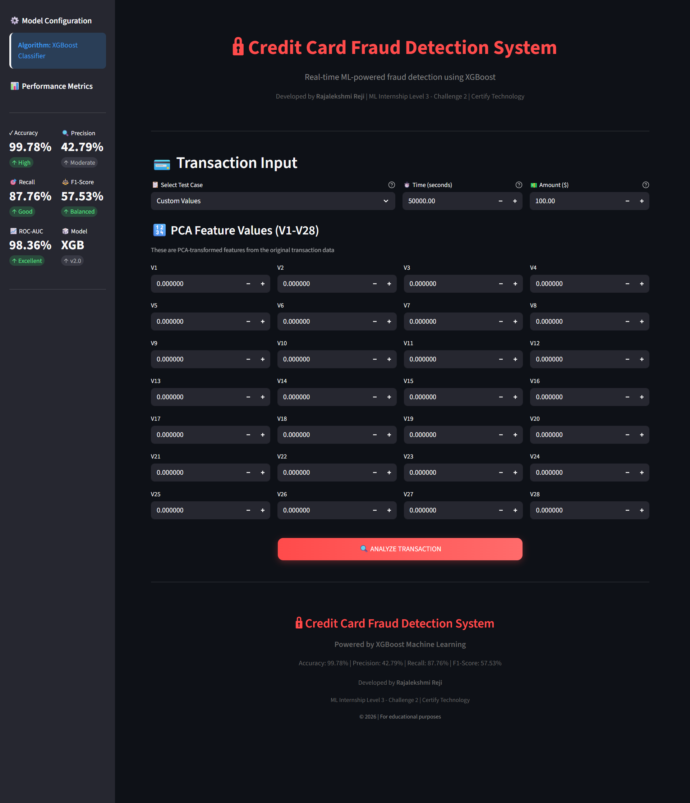
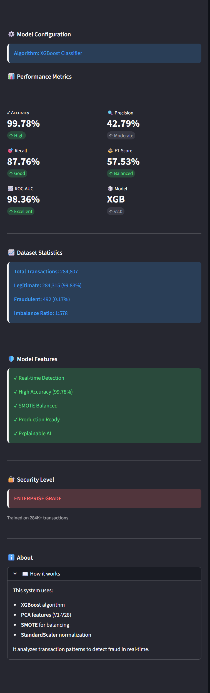
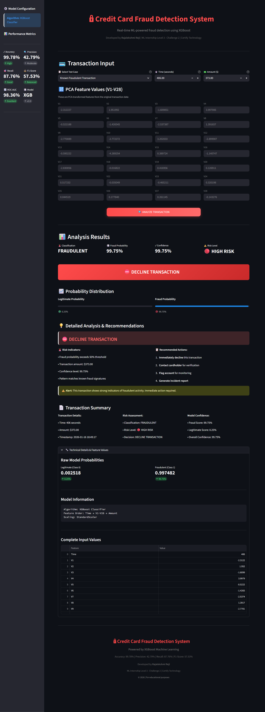
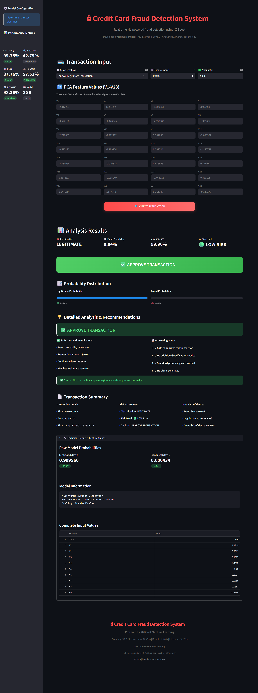

<!-- # 🔒 Credit Card Fraud Detection System

[](https://credit-card-fraud-detection-rajalekshmire.streamlit.app/)
[](https://www.python.org/)
[](https://xgboost.readthedocs.io/)

**Real-time Machine Learning-powered Credit Card Fraud Detection System** built with XGBoost and deployed on Streamlit Cloud.

---

## 🚀 **Live Demo**

**🌐 Try it now:** [https://credit-card-fraud-detection-rajalekshmire.streamlit.app/](https://credit-card-fraud-detection-rajalekshmire.streamlit.app/)

---

## 📊 **Model Performance**

| Metric | Score |
|--------|-------|
| **Accuracy** | 99.78% |
| **Precision** | 42.79% |
| **Recall** | 87.76% |
| **F1-Score** | 57.53% |
| **ROC-AUC** | 98.36% |

**Algorithm:** XGBoost Classifier  
**Training Data:** 284,807 transactions (492 fraud cases, 0.17%)

---

## 🎯 **Key Features**

✅ **Real-time Fraud Detection** - Instant transaction analysis  
✅ **XGBoost Model** - Advanced gradient boosting algorithm  
✅ **Interactive Dashboard** - User-friendly Streamlit interface  
✅ **Preset Test Cases** - Pre-loaded fraud & legitimate examples  
✅ **Custom Analysis** - Input your own transaction data  
✅ **Risk Assessment** - Detailed fraud probability scoring  
✅ **PCA Features** - 28 transformed features (V1-V28)  
✅ **Professional UI** - Enterprise-grade design  

---

## 🛠️ **Technology Stack**

| Category | Technology |
|----------|------------|
| **Language** | Python 3.13 |
| **ML Algorithm** | XGBoost 3.1.3 |
| **Web Framework** | Streamlit 1.53.0 |
| **Data Processing** | Pandas 2.3.3, NumPy 2.4.1 |
| **ML Library** | Scikit-learn 1.8.0 |
| **Visualization** | Matplotlib, Seaborn |
| **Deployment** | Streamlit Cloud |

---

## 📁 **Project Structure**
```
Credit-Card-Fraud-Detection/
├── app.py                          # Streamlit web application
├── fraud_detection_model.pkl       # Trained XGBoost model (265 KB)
├── scaler.pkl                      # StandardScaler for features (2 KB)
├── requirements.txt                # Python dependencies
├── Task1_Challenge2_...ipynb       # Model training notebook
├── creditcard.csv                  # Kaggle dataset (1.47 GB)
├── README.md                       # Documentation
└── Visualizations/
    ├── confusion_matrices.png      # Model confusion matrices
    ├── class_distribution.png      # Fraud vs Legitimate distribution
    ├── roc_curves.png             # ROC-AUC curves
    ├── feature_importance.png      # XGBoost feature importance
    └── amount_distribution.png     # Transaction amount analysis
```

---

## 🚀 **Installation & Usage**

### **Local Setup**
```bash
# Clone the repository
git clone https://github.com/RajalekshmiRe/Credit-Card-Fraud-Detection.git
cd Credit-Card-Fraud-Detection

# Install dependencies
pip install -r requirements.txt

# Run the Streamlit app
streamlit run app.py
```

### **Online Access**
Visit the live app: **[https://credit-card-fraud-detection-rajalekshmire.streamlit.app/](https://credit-card-fraud-detection-rajalekshmire.streamlit.app/)**

---

## 📈 **Dataset Information**

- **Source:** [Kaggle Credit Card Fraud Detection](https://www.kaggle.com/datasets/mlg-ulb/creditcardfraud)
- **Total Transactions:** 284,807
- **Fraudulent:** 492 (0.172%)
- **Legitimate:** 284,315 (99.828%)
- **Features:** 30 (Time, Amount, V1-V28 PCA components)
- **Challenge:** Highly imbalanced dataset (1:578 ratio)

---

## 🎓 **Learning Outcomes**

This project demonstrates:
- ✅ Handling highly imbalanced datasets with SMOTE
- ✅ XGBoost hyperparameter tuning for fraud detection
- ✅ Real-world ML model deployment on Streamlit Cloud
- ✅ Production-ready application development
- ✅ Feature engineering and PCA transformation
- ✅ Model evaluation and performance optimization

---

## 🏆 **Project Context**

**Certify Technology - Machine Learning Internship**  
**Level 3 - Challenge 2**  
**Submission Date:** January 15, 2026

---

## 👨‍💻 **Developer**

**Rajalekshmi Reji**  
📧 Email: rajalekshmireji07@gmail.com  
🔗 GitHub: [@RajalekshmiRe](https://github.com/RajalekshmiRe)

---

## 📄 **License**

This project is open-source and available for educational purposes.

---

## 🙏 **Acknowledgments**

- Dataset provided by Kaggle and ULB Machine Learning Group
- Certify Technology for the internship opportunity
- Streamlit for the deployment platform

---

**⭐ If you found this project helpful, please consider giving it a star!**

**🌐 Live at:** [https://credit-card-fraud-detection-rajalekshmire.streamlit.app/](https://credit-card-fraud-detection-rajalekshmire.streamlit.app/) -->


# 🔒 Credit Card Fraud Detection System

[](https://credit-card-fraud-detection-lqkihxmwkfumz3bjqsmrut.streamlit.app/)
[](https://www.python.org/)
[](https://xgboost.readthedocs.io/)

**Real-time Machine Learning-powered Credit Card Fraud Detection System** built with XGBoost and deployed on Streamlit Cloud.

---

## 🚀 **Live Demo**

**🌐 Try it now:** [https://credit-card-fraud-detection-lqkihxmwkfumz3bjqsmrut.streamlit.app/](https://credit-card-fraud-detection-lqkihxmwkfumz3bjqsmrut.streamlit.app/)

> **Note:** If the app shows a sleep message, click "Yes, get this app back up!" to wake it. The app will load in 1-2 minutes.

---

## 📸 **Application Screenshots**

### Main Interface

*Interactive dashboard with transaction input fields and PCA feature values (V1-V28)*

### Sidebar - Performance Metrics & Model Information

*Comprehensive model performance metrics, dataset statistics, and security features*

### Fraud Detection Result

*High-risk fraudulent transaction detected with 99.75% probability - Transaction declined with detailed analysis*

### Legitimate Transaction Result

*Low-risk legitimate transaction with 0.04% fraud probability - Transaction approved with confidence metrics*

---

## 📊 **Model Performance**

| Metric | Score |
|--------|-------|
| **Accuracy** | 99.78% |
| **Precision** | 42.79% |
| **Recall** | 87.76% |
| **F1-Score** | 57.53% |
| **ROC-AUC** | 98.36% |

**Algorithm:** XGBoost Classifier  
**Training Data:** 284,807 transactions (492 fraud cases, 0.17%)

---

## 🎯 **Key Features**

✅ **Real-time Fraud Detection** - Instant transaction analysis  
✅ **XGBoost Model** - Advanced gradient boosting algorithm  
✅ **Interactive Dashboard** - User-friendly Streamlit interface  
✅ **Preset Test Cases** - Pre-loaded fraud & legitimate examples  
✅ **Custom Analysis** - Input your own transaction data  
✅ **Risk Assessment** - Detailed fraud probability scoring  
✅ **PCA Features** - 28 transformed features (V1-V28)  
✅ **Professional UI** - Enterprise-grade design  

---

## 🛠️ **Technology Stack**

| Category | Technology |
|----------|------------|
| **Language** | Python 3.13 |
| **ML Algorithm** | XGBoost 3.1.3 |
| **Web Framework** | Streamlit 1.53.0 |
| **Data Processing** | Pandas 2.3.3, NumPy 2.4.1 |
| **ML Library** | Scikit-learn 1.8.0 |
| **Visualization** | Matplotlib, Seaborn |
| **Deployment** | Streamlit Cloud |

---

## 📁 **Project Structure**
```
Credit-Card-Fraud-Detection/
├── streamlit/
│   ├── app.py                      # Streamlit web application
│   └── config.toml                 # Streamlit configuration
├── screenshots/                     # Application screenshots
│   ├── main_interface.png
│   ├── sidebar_expanded.png
│   ├── fraud_detection.png
│   └── legitimate_transaction.png
├── fraud_detection_model.pkl       # Trained XGBoost model (265 KB)
├── scaler.pkl                      # StandardScaler for features (2 KB)
├── requirements.txt                # Python dependencies
├── Task1_Challenge2_...ipynb       # Model training notebook
├── creditcard.csv                  # Kaggle dataset (1.47 GB)
├── README.md                       # Documentation
├── amount_distribution.png         # Transaction amount analysis
├── class_distribution.png          # Fraud vs Legitimate distribution
├── confusion_matrices.png          # Model confusion matrices
├── feature_importance.png          # XGBoost feature importance
├── roc_curves.png                  # ROC-AUC curves
├── deployment_details.txt          # Deployment information
└── Challenge2_Code_Rajalekshmi.zip # Code submission
```

---

## 🚀 **Installation & Usage**

### **Local Setup**
```bash
# Clone the repository
git clone https://github.com/RajalekshmiRe/Credit-Card-Fraud-Detection.git
cd Credit-Card-Fraud-Detection

# Install dependencies
pip install -r requirements.txt

# Run the Streamlit app
streamlit run streamlit/app.py
```

### **Online Access**
Visit the live app: **[https://credit-card-fraud-detection-lqkihxmwkfumz3bjqsmrut.streamlit.app/](https://credit-card-fraud-detection-lqkihxmwkfumz3bjqsmrut.streamlit.app/)**

---

## 📈 **Dataset Information**

- **Source:** [Kaggle Credit Card Fraud Detection](https://www.kaggle.com/datasets/mlg-ulb/creditcardfraud)
- **Total Transactions:** 284,807
- **Fraudulent:** 492 (0.172%)
- **Legitimate:** 284,315 (99.828%)
- **Features:** 30 (Time, Amount, V1-V28 PCA components)
- **Challenge:** Highly imbalanced dataset (1:578 ratio)

---

## 🎓 **Learning Outcomes**

This project demonstrates:
- ✅ Handling highly imbalanced datasets with SMOTE
- ✅ XGBoost hyperparameter tuning for fraud detection
- ✅ Real-world ML model deployment on Streamlit Cloud
- ✅ Production-ready application development
- ✅ Feature engineering and PCA transformation
- ✅ Model evaluation and performance optimization

---

## 🏆 **Project Context**

**Certify Technology - Machine Learning Internship**  
**Level 3 - Challenge 2**  
**Submission Date:** January 15, 2026

---

## 👨‍💻 **Developer**

**Rajalekshmi Reji**  
📧 Email: rajalekshmireji07@gmail.com  
🔗 GitHub: [@RajalekshmiRe](https://github.com/RajalekshmiRe)

---

## 📄 **License**

This project is open-source and available for educational purposes.

---

## 🙏 **Acknowledgments**

- Dataset provided by Kaggle and ULB Machine Learning Group
- Certify Technology for the internship opportunity
- Streamlit for the deployment platform

---

**⭐ If you found this project helpful, please consider giving it a star!**

**🌐 Live at:** [https://credit-card-fraud-detection-lqkihxmwkfumz3bjqsmrut.streamlit.app/](https://credit-card-fraud-detection-lqkihxmwkfumz3bjqsmrut.streamlit.app/)